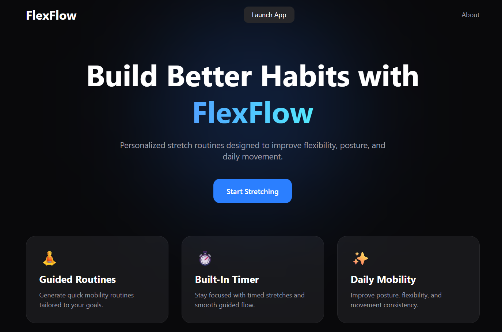
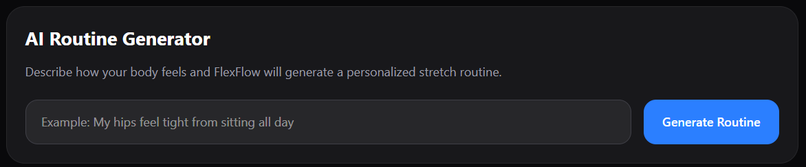
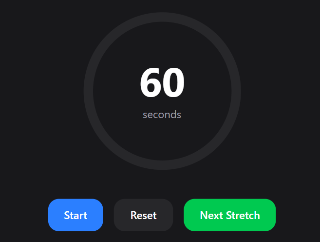
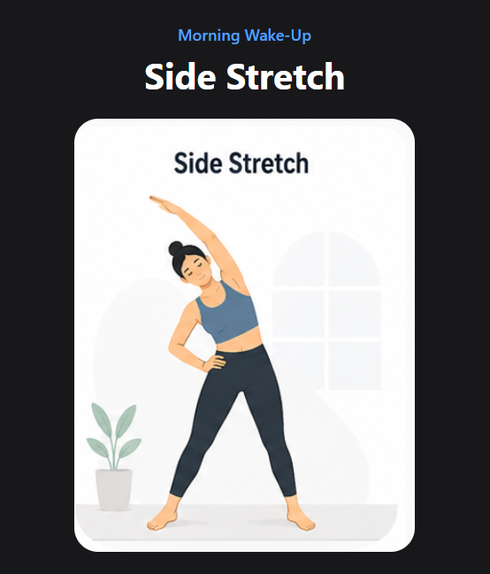

# FlexFlow AI Stretch App

FlexFlow is a modern React-based wellness application that helps users generate personalized stretch and mobility routines. Users can select pre-built routines or use the built-in AI-inspired routine generator to create custom stretches based on how their body feels.

## Features

* AI-inspired stretch routine generator
* Guided stretch timer with animated circular progress
* Multiple mobility goals and categories
* Difficulty filtering (Beginner, Intermediate, Advanced)
* Animated modern UI using Framer Motion
* Persistent progress tracking using localStorage
* Responsive design for desktop and mobile
* Landing page with smooth onboarding flow
* Interactive stretch cards with illustrations

---

## AI Routine Generator

Users can describe how they feel, for example:

* "My hips feel tight from sitting all day"
* "I need energy in the morning"
* "My posture is bad"

FlexFlow analyzes keywords and dynamically generates a personalized mobility routine.

---

## Tech Stack

* React
* Vite
* Tailwind CSS
* Framer Motion
* React Router DOM
* LocalStorage API

---

## Project Structure

```bash
src/
│
├── components/
│   └── LandingPage.jsx
│
├── data/
│   └── stretches.js
│
├── pages/
│   ├── Home.jsx
│   └── About.jsx
│
├── App.jsx
├── main.jsx
└── index.css
```

---

## Installation

Clone the repository:

```bash
git clone https://github.com/amnahirfan6/FlexFlow-App.git
```

Navigate into the project:

```bash
cd FlexFlow-App
```

Install dependencies:

```bash
npm install
```

Run the development server:

```bash
npm run dev
```

---

## Future Improvements

* OpenAI-powered routine generation
* Stretch recommendations based on injuries
* User authentication
* Saved favorite routines
* Daily streak system
* Voice input support
* Analytics dashboard

---

## Screenshots

Add screenshots of:

* Landing page


* AI generator



* Timer screen



* Stretch cards



---

## Author

Built by Amnah Irfan.
